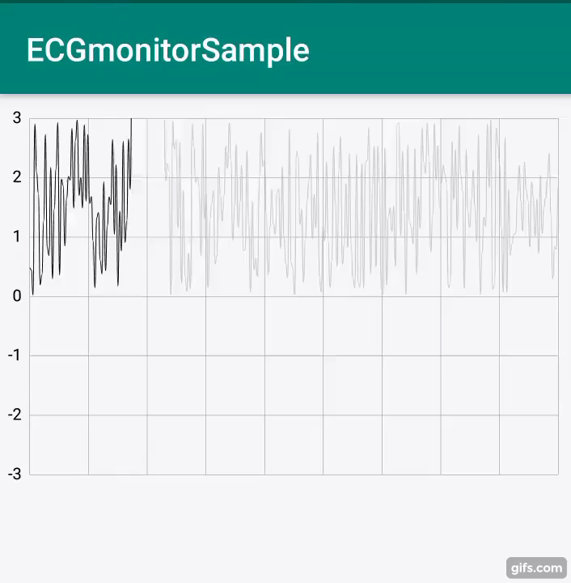

# ECGmonitorSample
This is realtime ECG monitor



## How To Use
- .xml
```
<com.aqoong.lib.ecgmonitor.MonitorView
        android:id="@+id/monitor"
        android:layout_width="match_parent"
        android:layout_height="250dp"
        app:backgroundColor="#FFFFFF"
        app:lineColor="#000000"
        app:traceSpace="20"
        app:lineWidth="0.5"
        app:traceLineColor="#C8C8C8"
        />
```
- .java
```
  MonitorView vMonitor = findViewById(R.id.monitor);
  vMonitor.updateData([xValue], [yValue]);
```


## Import Library
- MPAndroidChart (https://github.com/PhilJay/MPAndroidChart)

# Lisence

Copyright 2020 WONWOO

Licensed under the Apache License, Version 2.0 (the "License"); you may not use this file except in compliance with the License. You may obtain a copy of the License at

http://www.apache.org/licenses/LICENSE-2.0

Unless required by applicable law or agreed to in writing, software distributed under the License is distributed on an "AS IS" BASIS, WITHOUT WARRANTIES OR CONDITIONS OF ANY KIND, either express or implied. See the License for the specific language governing permissions and limitations under the License.
